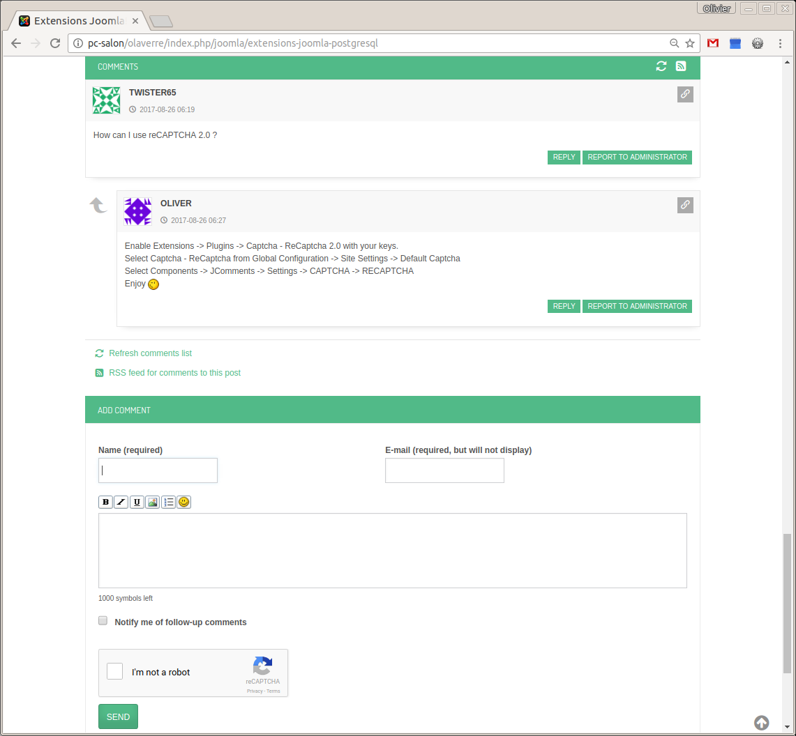

# com_jcomments
The JComments is a powerful and easy to use AJAX based comment system for Joomla with flexible ACL, smiles, BBCodes and avatars support.
This is the JComments release, that you can find at http://www.joomlatune.com/jcomments-downloads.html, with postgreSQL (and MySQL) support, Joomla reCaptcha plugins (reCAPTCHA "I am not a robot" and "invisible"), and JoomSpirit theme.
For more information, see the Wiki page.

